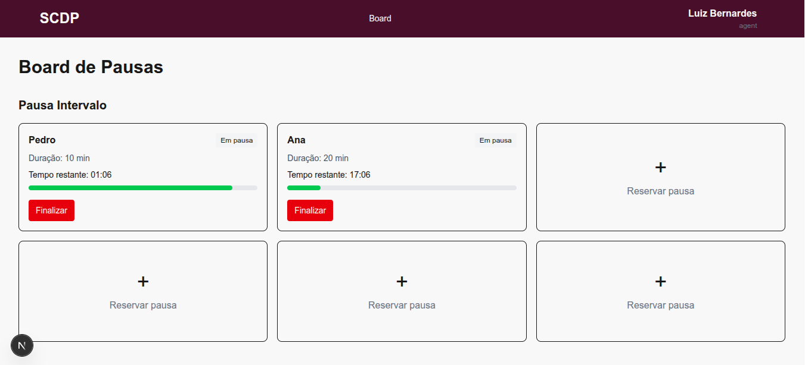
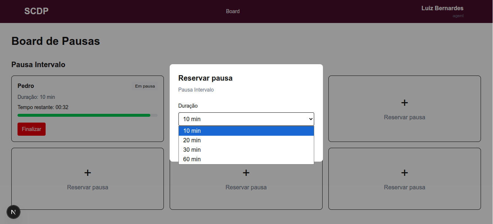
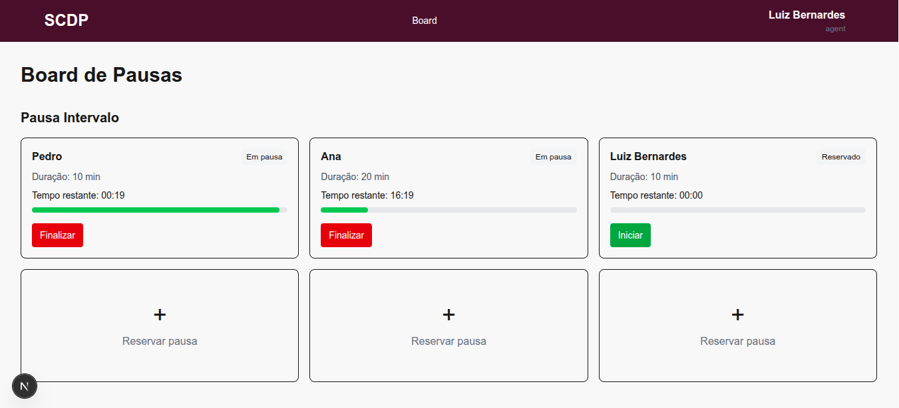
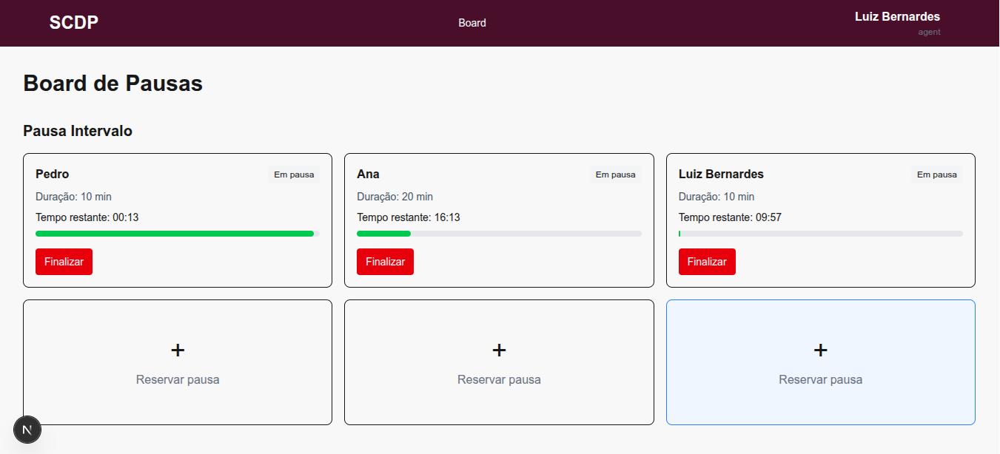
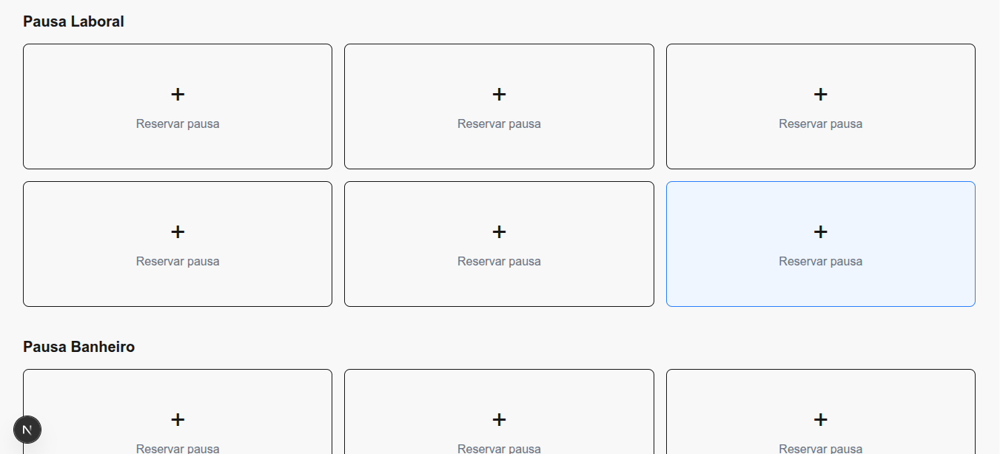
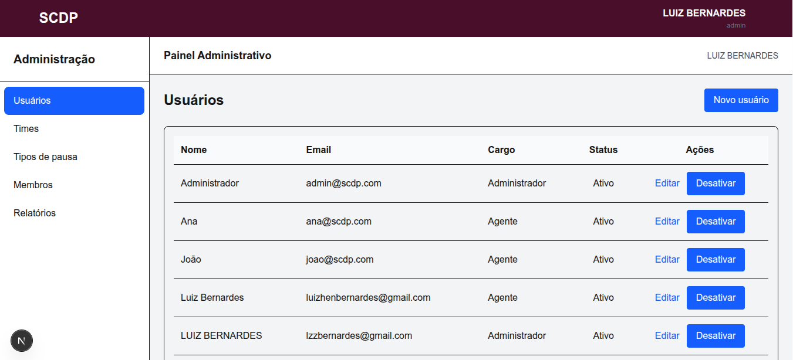
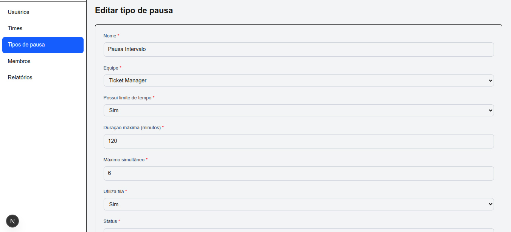

# SCDP

Sistema Corporativo de Pausas.

O SCDP é um sistema para gerenciamento de pausas de colaboradores, permitindo controlar equipes, usuários, tipos de pausa, pausas em andamento e filas de espera em tempo real.

O projeto é dividido em dois ambientes principais:

```text
scdp/
├── scdp-api/
└── scdp-web/
```

## Arquitetura

```text
┌─────────────────────┐
│       SCDP Web      │
│      Next.js        │
│                     │
│  Interface Admin    │
│  Componentes        │
│  Hooks              │
│  Services           │
└──────────┬──────────┘
           │ HTTP / JSON
           ▼
┌─────────────────────┐
│       SCDP API      │
│       Rails         │
│                     │
│ Controllers         │
│ Models              │
│ Services            │
│ Presenters          │
│ Authentication      │
└──────────┬──────────┘
           │
           ▼
┌─────────────────────┐
│    PostgreSQL       │
└─────────────────────┘
```

A aplicação web é responsável pela interface e comunicação com a API.

A API concentra as regras de negócio, autenticação, persistência e acesso ao banco de dados.

## Projetos

### SCDP API

Local:

```text
scdp/scdp-api
```

Tecnologias principais:

* Ruby
* Rails
* PostgreSQL
* Redis
* RSpec
* JWT
* OAuth

A API disponibiliza os endpoints utilizados pelo frontend.

### SCDP Web

Local:

```text
scdp/scdp-web
```

Tecnologias principais:

* Next.js
* React
* TypeScript
* Tailwind CSS

O frontend consome a API através de requisições HTTP.

## Módulos administrativos

Atualmente o ambiente administrativo possui CRUDs para:

* Usuários
* Equipes
* Membros de equipes
* Tipos de pausa

Estrutura geral:

```text
Admin
├── Usuários
├── Equipes
├── Membros de equipes
└── Tipos de pausa
```

## Conceitos principais

### Usuários

Representam os usuários do sistema.

Possuem diferentes níveis de acesso:

```text
super_admin
admin
supervisor
agent
```

### Equipes

Agrupam usuários e possuem configurações próprias.

### Membros de equipe

Representam a associação entre uma pessoa e uma equipe.

O convite pode ser realizado através do e-mail antes mesmo de o usuário possuir uma conta local no sistema.

Quando o usuário realiza o primeiro login através do provedor de autenticação, essa associação pode ser vinculada ao usuário.

### Tipos de pausa

Definem as regras de uma pausa.

Entre suas configurações estão:

* Nome
* Equipe
* Limite de tempo
* Duração máxima
* Máximo de pausas simultâneas
* Utilização de fila
* Status ativo/inativo

Exemplo:

```text
Intervalo 10 minutos
├── Limite de tempo: Sim
├── Duração: 10 minutos
├── Máximo simultâneo: 2
└── Utiliza fila: Sim
```

Também existem tipos de pausa sem limite de tempo, nos quais o usuário encerra manualmente a pausa.

## Estrutura de diretórios

```text
scdp/
│
├── scdp-api/
│   ├── app/
│   ├── config/
│   ├── db/
│   ├── spec/
│   └── ...
│
├── scdp-web/
│   ├── src/
│   ├── public/
│   └── ...
│
└── README.md
```
## Estrutura exemplo de uma entidade

```text
components/admin/pause-types/
├── table/
│   ├── PauseTypesTable.tsx
│   ├── PauseTypeTableRow.tsx
│   └── DeletePauseTypeButton.tsx
├── form/
│   └── PauseTypeForm.tsx
├── pages/
│   ├── PauseTypesPage.tsx
│   ├── NewPauseTypePage.tsx
│   └── EditPauseTypePage.tsx
└── index.ts

E:

hooks/admin/
├── usePauseTypes.ts
├── usePauseType.ts
└── usePauseTypeActions.ts

services/admin/
└── pause-type-service.ts

app/admin/pause-types/
├── page.tsx
├── new/
│   └── page.tsx
└── [id]/
    └── edit/
        └── page.tsx

No backend:

app/controllers/admin/pause_types_controller.rb
app/services/admin/pause_type_presenter.rb
spec/requests/admin/pause_types_spec.rb
```

## Desenvolvimento

Cada ambiente possui seu próprio README com as instruções específicas:

* API: `scdp-api/README.md`
* Web: `scdp-web/README.md`

A API deve estar disponível para que o frontend consiga realizar as operações que dependem do backend.

## Fluxo básico

Durante o desenvolvimento, normalmente os dois projetos são executados separadamente:

```text
Terminal 1 (rails s -p 3001)
→ scdp-api
→ Rails server

Terminal 2 (npm run dev)
→ scdp-web
→ Next.js server
```

O frontend então realiza as requisições para a API.

## Status

Os módulos administrativos básicos já possuem estrutura de CRUD implementada e testada.

O funcionalidade principal do projeto o board, já funciona normalmente.

Está pendende algumas melhorias de layout, tratamento de mensagens de erro e experiência do usuário (UX).

<table>
  <tr>
    <td></td>
    <td></td>
  </tr>
  <tr>
    <td></td>
    <td></td>
  </tr>
  <tr>
    <td></td>
    <td></td>
  </tr>
  <tr>
    <td></td>
    <td></td>
  </tr>
</table>